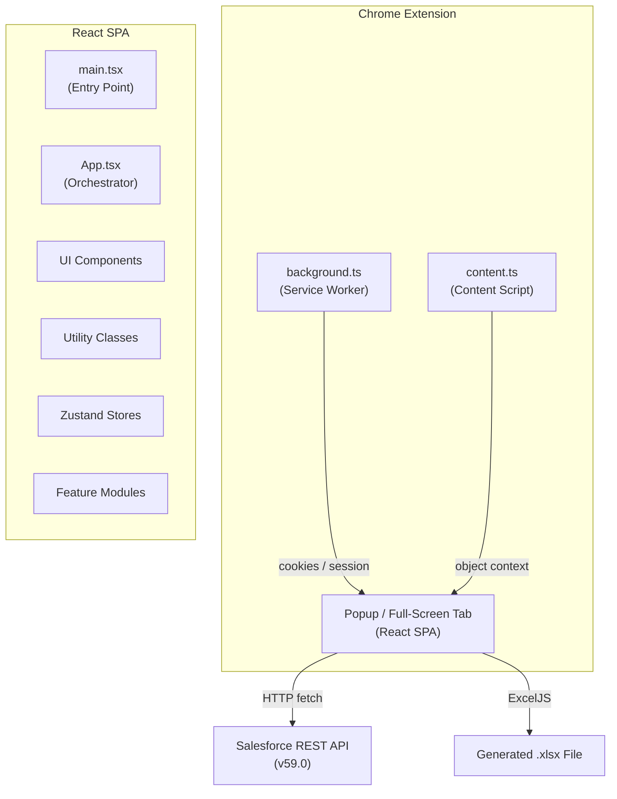
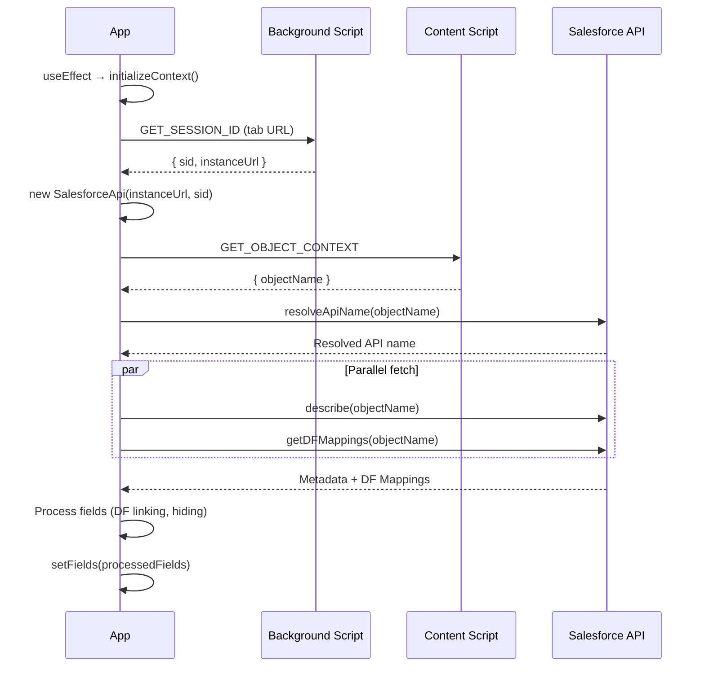
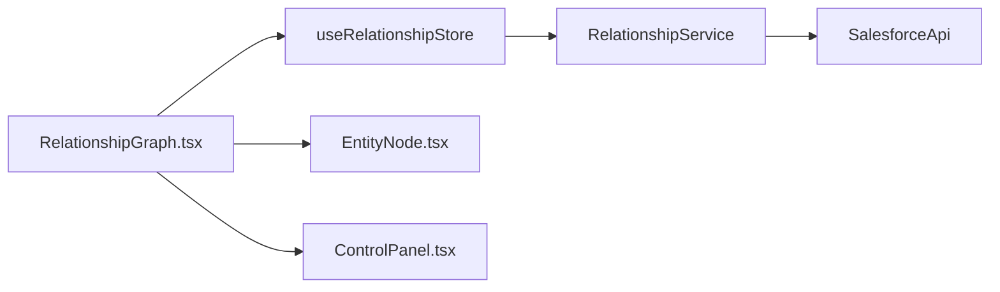
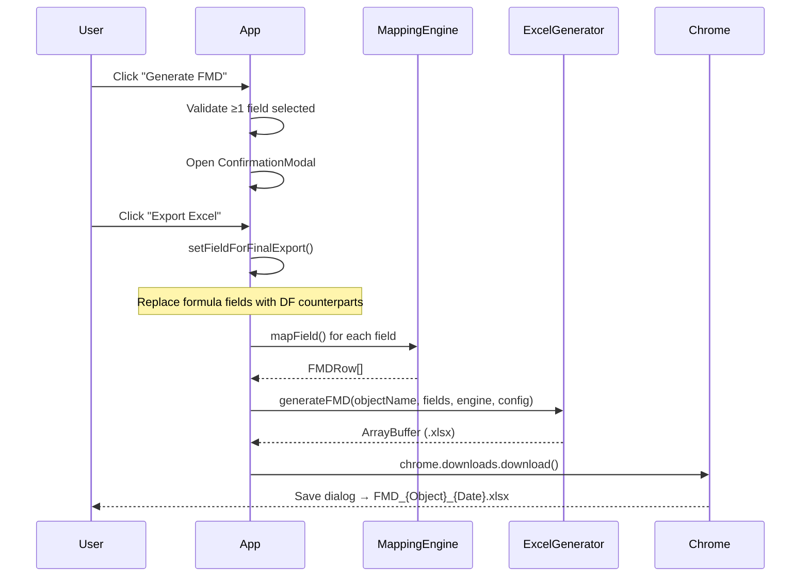

# SchemaForge Studio — Architecture Document

> **Chrome Extension (Manifest V3)** that generates BigQuery Field Mapping Documents (FMD) from Salesforce Object Metadata.

---

## 1. High-Level Overview



### What It Does

1. **Detects context** — When opened on a Salesforce Setup > Object Manager page, it auto-detects the current SObject.
2. **Fetches metadata** — Calls the Salesforce `describe` API to pull every field's definition.
3. **Maps types** — Converts Salesforce field types → BigQuery types using a configurable mapping engine.
4. **Handles formula fields** — Resolves "Destinational Field" (DF) mappings for formula fields from a Custom Metadata Type (`DF_Formula_Field_Mapping__mdt`).
5. **Generates Excel** — Outputs a styled `.xlsx` FMD with source/target columns via ExcelJS.
6. **Visualises relationships** — An interactive graph (React Flow) shows object lookup/master-detail relationships.

---

## 2. Technology Stack

| Category | Technology | Version |
|---|---|---|
| Runtime | Chrome Extension (Manifest V3) | — |
| UI Framework | React | 19.x |
| Language | TypeScript | 5.x |
| Build Tool | Vite + `@crxjs/vite-plugin` | 7.x |
| Styling | Tailwind CSS 4 | 4.x |
| State Management | Zustand (with `persist` middleware) | 5.x |
| Graph Visualisation | @xyflow/react (React Flow) | 12.x |
| Excel Generation | ExcelJS | 4.x |
| Icons | lucide-react | 0.563.x |

---

## 3. Project Structure

```
SFtoBigQueryFMDGeneratorExtension/
├── manifest.json              # Chrome MV3 manifest
├── index.html                 # SPA entry HTML
├── vite.config.ts             # Vite + CRX + Tailwind plugins
├── tsconfig.json              # TypeScript config (ES2020, bundler mode)
├── package.json               # "schemaforge-studio" v1.0.0
│
├── public/assets/             # Extension icons (16/48/128px)
│
├── scripts/                   # Standalone debug/test scripts
│   ├── test-mapping-repro.ts
│   ├── test-numeric-precision.ts
│   └── test-source-type-logic.ts
│
└── src/
    ├── main.tsx               # ReactDOM.createRoot → <App />
    ├── App.tsx                # Root orchestrator (530 lines)
    ├── index.css              # Tailwind imports, CSS custom properties, scrollbar styles
    ├── types.ts               # Shared TypeScript interfaces
    ├── background.ts          # Service Worker — session cookie extraction
    ├── content.ts             # Content Script — object name detection
    ├── vite-env.d.ts          # Vite type reference
    │
    ├── components/
    │   ├── Header.tsx         # App bar — logo, theme toggle, maximize button
    │   ├── Tabs.tsx           # Tab navigation — Fields, Mapping Rules, Relationships, Settings
    │   ├── FieldTable.tsx     # Sortable/configurable field grid with DF mapping rows
    │   ├── MappingRules.tsx   # Editable SF→BQ type mapping table
    │   ├── Settings.tsx       # Preferences: POC, dimensions, theme colors
    │   ├── VirtualFieldModal.tsx   # Modal to add custom/virtual fields
    │   └── ConfirmationModal.tsx   # Pre-export review modal
    │
    ├── utils/
    │   ├── salesforceApi.ts   # SalesforceApi class — describe, query, resolveApiName, getDFMappings
    │   ├── mappingEngine.ts   # MappingEngine — SF→BQ type mapping & source type formatting
    │   └── excelGenerator.ts  # ExcelGenerator — FMD worksheet creation & download
    │
    ├── store/
    │   └── settingsStore.ts   # Zustand persistent store — dimensions + theme colors
    │
    └── modules/
        └── relationship-graph/
            ├── graphTypes.ts              # EntityNodeData, EntityNode, RelationshipService interfaces
            ├── components/
            │   ├── RelationshipGraph.tsx   # ReactFlow canvas + controls
            │   ├── EntityNode.tsx          # Custom node component (memo)
            │   └── ControlPanel.tsx        # Depth selector, reset/center buttons
            ├── services/
            │   └── relationshipService.ts  # BFS graph builder, expand/collapse logic
            └── store/
                └── useRelationshipStore.ts # Zustand store for graph state
```

---

## 4. Chrome Extension Architecture

### 4.1 Manifest (manifest.json)

| Property | Value |
|---|---|
| `manifest_version` | 3 |
| `name` | SchemaForge Studio |
| `permissions` | `activeTab`, `storage`, `downloads`, `scripting`, `cookies` |
| `host_permissions` | `*.salesforce.com`, `*.my.salesforce.com`, `*.lightning.force.com`, `*.salesforce-setup.com` |
| `action.default_popup` | `index.html` |
| `background.service_worker` | `src/background.ts` |
| `content_scripts` | `src/content.ts` — injected on all Salesforce domains |

### 4.2 Background Script (`background.ts`)

**Role**: Service Worker that extracts the Salesforce session ID from browser cookies.

```
Message: { action: "GET_SESSION_ID", url: string }
Response: { sid: string | null, instanceUrl: string }
```

**Flow**:
1. Receives `GET_SESSION_ID` message from the popup.
2. Calls `chrome.cookies.getAll()` for the tab URL's `sid` cookie.
3. Falls back to domain-wide `salesforce.com` cookies.
4. Returns `{ sid, instanceUrl }` to the popup.

### 4.3 Content Script (`content.ts`)

**Role**: Runs in the Salesforce page context to detect which SObject the user is viewing.

```
Message: { action: "GET_OBJECT_CONTEXT" }
Response: { objectName: string | null }
```

**Flow**:
1. Receives `GET_OBJECT_CONTEXT` message from the popup.
2. Parses `window.location.href` with regex: `/lightning/setup/ObjectManager/([a-zA-Z0-9_]+)/`.
3. Returns the captured object name (may be an API name or a Durable ID).

---

## 5. Application Layer (React SPA)

### 5.1 Entry Point (`main.tsx`)

Standard React 19 bootstrap: `ReactDOM.createRoot` renders `<App />` inside `<React.StrictMode>`.

### 5.2 Root Orchestrator (`App.tsx` — 530 lines)

The monolithic orchestrator that wires together all state, API calls, and UI rendering.

#### State Managed

| State | Type | Purpose |
|---|---|---|
| `theme` | `'light' \| 'dark'` | UI theme, persisted to `localStorage` |
| `activeTab` | `string` | Current tab: `fields`, `mapping`, `relationships`, `settings` |
| `statusMsg` | `string` | Footer status indicator |
| `currentObject` | `string \| null` | Detected Salesforce object name |
| `fields` | `SalesforceField[]` | Full field list with selection & DF mapping state |
| `filter` | `string` | Field name/label search filter |
| `includeSystemFields` | `boolean` | Whether to show system fields |
| `poc` | `string` | Point of Contact for the FMD |
| `sfApi` | `SalesforceApi \| null` | Authenticated API instance |
| `isModalOpen` | `boolean` | Virtual field modal visibility |
| `isConfirmModalOpen` | `boolean` | Export confirmation modal visibility |
| `showRefresh` | `boolean` | Show refresh button on connection failure |
| `isFullScreen` | `boolean` | Full-screen tab mode (via `tabId` URL param) |

#### Initialization Flow



#### DF (Formula Field) Processing Logic

1. **First Pass**: Each field gets `dfMapping.mappedDfName` from `DF_Formula_Field_Mapping__mdt`.
2. **Second Pass**:
   - If a formula field has a mapped DF → the DF field is marked `hidden: true`, and its details are copied into the formula field's `manualDf`.
   - If a formula field has no mapping → a default `DF_` prefixed name is auto-generated.
3. **Export**: Formula fields are replaced with their DF counterparts in the final Excel output.

#### Full-Screen Mode

Triggered by `?tabId=<id>` URL parameter:
- `handleMaximize()` opens `index.html?tabId=<tabId>` in a new Chrome tab.
- Layout switches from fixed popup dimensions to `w-full h-screen`.

---

## 6. Components

### 6.1 Header (`Header.tsx` — 42 lines)

| Feature | Implementation |
|---|---|
| Logo + Branding | `assets/icon48.png` + "SchemaForge Studio" title |
| Theme Toggle | `Moon`/`Sun` icon, calls `toggleTheme()` |
| Maximize Button | Visible only in popup mode (`!isFullScreen`) |

### 6.2 Tabs (`Tabs.tsx` — 37 lines)

Four-tab navigation with Lucide icons:

| Tab ID | Label | Icon |
|---|---|---|
| `fields` | Fields | `List` |
| `mapping` | Mapping Rules | `ArrowRightLeft` |
| `relationships` | Relationships | `Share2` |
| `settings` | Settings | `Settings` |

Active tab shows a purple underline indicator via CSS `after` pseudo-element.

### 6.3 FieldTable (`FieldTable.tsx` — 323 lines)

The main data grid for viewing and selecting Salesforce fields.

**Key Features**:
- **Configurable Columns**: 10 available columns; users toggle visibility via a `Settings2` gear icon.
- **Column IDs**: `name`, `label`, `type`, `length`, `precision`, `scale`, `attributes`, `calculatedFormula`, `referenceTo`, `relationshipName`.
- **Default Visible**: `name`, `label`, `type`, `length`, `precision`, `attributes`.
- **Sorting**: Click column headers → ascending/descending sort with `ChevronUp`/`ChevronDown` icons.
- **Attribute Badges**: `FORMULA` (purple), `CUSTOM` (green), `SYSTEM` (gray).
- **DF Mapping Row**: Expandable sub-row for formula fields showing Label, API Name, Type, Length, Precision, Scale inputs.
- **Select All**: Header checkbox toggles all field selections.
- **Dynamic Grid**: CSS Grid with dynamic `gridTemplateColumns` based on visible columns.

### 6.4 MappingRules (`MappingRules.tsx` — 149 lines)

Editable Salesforce → BigQuery type mapping table.

**Sections**: Text, Number, Date & Time, Contact & URL, Picklist, Relationship, Advanced/Special, Other/Custom.

**Available BigQuery Types**: `STRING`, `BYTES`, `INTEGER`, `INT64`, `FLOAT`, `FLOAT64`, `NUMERIC`, `BIGNUMERIC`, `BOOLEAN`, `BOOL`, `TIMESTAMP`, `DATE`, `TIME`, `DATETIME`, `GEOGRAPHY`, `JSON`, `RECORD`, `STRUCT`.

**Persistence**: Saved to `chrome.storage.local` via `MappingEngine.saveMappings()`.

### 6.5 Settings (`Settings.tsx` — 181 lines)

| Section | Contents |
|---|---|
| Active Object | Displays current SF object being processed |
| User Preferences | POC name, Include System Fields toggle |
| Popup Dimensions | Width/Height sliders (only in popup mode) |
| Theme Colors | 12 color pickers for full theme customization |
| Developer Footer | Author, GitHub, LinkedIn, Portfolio links |

All settings are persisted via Zustand `persist` middleware → `localStorage`.

### 6.6 VirtualFieldModal (`VirtualFieldModal.tsx` — 131 lines)

Modal for adding custom "virtual" fields that don't exist in Salesforce.

**Form Fields**: API Name*, Label*, Type* (dropdown), Length.
**Available Types**: String, Double, Currency, Date, DateTime, Boolean, ID.
**Behavior**: Created fields are prepended to the field list with `isVirtual: true`.

### 6.7 ConfirmationModal (`ConfirmationModal.tsx` — 75 lines)

Pre-export review modal showing all fields that will be exported.

**Columns**: API Name, Label, Type, Source (DF MAPPED / STANDARD badge).
**Actions**: Cancel or Export Excel.

---

## 7. Utility Classes

### 7.1 SalesforceApi (`salesforceApi.ts` — 91 lines)

REST API wrapper authenticated via session cookie.

| Method | Endpoint | Purpose |
|---|---|---|
| `describe(objectName)` | `/services/data/v59.0/sobjects/{obj}/describe` | Fetch full field metadata |
| `query(soql)` | `/services/data/v59.0/query?q=...` | Execute arbitrary SOQL |
| `resolveApiName(idOrName)` | SOQL on `EntityDefinition` | Convert Durable ID → API Name |
| `getDFMappings(objectName)` | SOQL on `DF_Formula_Field_Mapping__mdt` | Fetch formula ↔ DF field mappings |

### 7.2 MappingEngine (`mappingEngine.ts` — 186 lines)

Handles Salesforce → BigQuery type conversion.

#### Default Type Mappings

| SF Type(s) | BQ Type |
|---|---|
| `string`, `textarea`, `email`, `url`, `phone`, `picklist`, `multipicklist`, `combobox`, `reference`, `id`, `encryptedstring`, `anytype`, `address`, `location`, `base64` | `STRING` |
| `currency`, `double`, `int`, `percent` | `FLOAT` |
| `date`, `datetime`, `time` | `TIMESTAMP` |
| `boolean` | `BOOLEAN` |

#### Key Methods

| Method | Description |
|---|---|
| `getBigQueryType(field)` | Returns BQ type using priority: field name overrides → type category → dictionary lookup → fallback `STRING` |
| `getFormattedSourceType(field)` | Formats source type string for display. Numeric types show `type(integerPart, scale)` where `integerPart = precision - scale`. Lookup fields show `Lookup(ReferenceTo)`. Roll-up summaries detected heuristically. |
| `mapField(field, objectName, config)` | Produces a complete `FMDRow` with source/target mapping |
| `loadMappings()` / `saveMappings()` / `resetMappings()` | Persist custom mappings to `chrome.storage.local` |

### 7.3 ExcelGenerator (`excelGenerator.ts` — 164 lines)

Generates a styled `.xlsx` workbook using ExcelJS.

#### Sheet Layout

| Section | Rows | Content |
|---|---|---|
| **Metadata** | 1–4 | Platform ("DataFabric"), Table Name, Volume, POC |
| **Source Header** (blue `#00B0F0`) | 8 | Field Name, Table Name, Type, Length, PII |
| **Target Header** (purple `#7030A0`) | 8 | Field Name, Table Name, Type, Length |
| **Data Rows** | 9+ | One row per field with source ↔ target mapping |

**Columns**: A–E (Source), F (spacer), G–J (Target).

**Download**: Uses `chrome.downloads.download()` with `saveAs: true`.

**Filename Pattern**: `FMD_{ObjectName}_{YYYYMMDD}.xlsx`

---

## 8. State Management

### 8.1 Settings Store (`settingsStore.ts`)

```
Zustand + persist middleware → localStorage key: "app-settings"
```

| State | Default | Description |
|---|---|---|
| `mobileWidth` | `600` | Popup width in px |
| `mobileHeight` | `550` | Popup height in px |
| `themeColors` | 12 color tokens | Full theme customization |

**Actions**: `setMobileWidth`, `setMobileHeight`, `setThemeColor`, `resetSettings`.

### 8.2 Relationship Store (`useRelationshipStore.ts`)

```
Zustand (non-persisted) — manages graph state
```

| State | Description |
|---|---|
| `nodes` / `edges` | ReactFlow graph elements |
| `loading` / `error` | Async status |
| `depth` | Relationship traversal depth (1–3) |
| `currentObject` | Root object being graphed |
| `visitedObjects` | `Set<string>` for BFS deduplication |
| `service` | `RelationshipService` instance |

**Actions**: `setService`, `setDepth`, `fetchGraph`, `expandNode`, `toggleNode`, `onNodesChange`, `onEdgesChange`, `reset`.

---

## 9. Relationship Graph Module

A self-contained feature module under `src/modules/relationship-graph/`.

### 9.1 Architecture



### 9.2 RelationshipService (`relationshipService.ts` — 282 lines)

Core graph-building logic using BFS traversal.

| Method | Description |
|---|---|
| `describeObject(name)` | Cached `SalesforceApi.describe()` call |
| `buildGraphForObject(name, depth)` | BFS traversal up to `depth` levels. Creates nodes positioned radially around parent. Creates edges labeled with relationship type (Master-Detail vs Lookup). |
| `expandNode(nodeId, nodes, edges)` | On-demand expansion of a collapsed node — adds child nodes/edges radially |
| `collapseNode(nodeId, nodes, edges)` | Removes descendants, respecting shared references (only removes nodes with ≤1 incoming edge) |

**Edge Styling**:
- Master-Detail: solid black line, `strokeWidth: 2`
- Lookup: dashed gray line, `strokeWidth: 1`

### 9.3 EntityNode (`EntityNode.tsx` — 69 lines)

Custom ReactFlow node, `memo`ized for performance.

**Layout**: Header (icon + label + API name + badge), Stats (field count + reference count), Handles (left=target, right=source).

**Visual Badges**: `CUST` (orange) for custom objects, `STD` (blue) for standard objects.

### 9.4 ControlPanel (`ControlPanel.tsx` — 51 lines)

Floating overlay with depth selector (1–3 levels), reset, and center-view buttons.

---

## 10. Type Definitions (`types.ts`)

### SalesforceField
The core data model representing a Salesforce field with UI-specific extensions.

| Property | Type | Description |
|---|---|---|
| `name`, `label`, `type` | `string` | Core field identity |
| `length`, `precision`, `scale` | `number?` | Numeric metadata |
| `nillable`, `calculated`, `custom` | `boolean?` | Field characteristics |
| `referenceTo` | `string[]?` | Lookup target objects |
| `calculatedFormula` | `string?` | Formula expression |
| `dfMapping` | `{ mappedDfName?, manualDf? }` | DF mapping for formula fields |
| `selected`, `isVirtual`, `hidden` | `boolean?` | UI state flags |

### FMDRow
Represents one row in the exported Excel FMD.

| Field | Description |
|---|---|
| `sourceObject`, `sourceField`, `sourceType` | Source metadata |
| `length`, `precision`, `scale` | Numeric dimensions |
| `targetField`, `targetType`, `mode` | Target (BigQuery) mapping |
| `dataset`, `table` | BigQuery destination |

### EntityNodeData / EntityNode
React Flow node types for the relationship graph.

---

## 11. Styling & Theming

### CSS Architecture

- **Tailwind CSS 4** with `@tailwindcss/vite` plugin (no PostCSS config needed).
- **Dark mode**: Via `.dark` class on `<html>`, toggled by `Header` component.
- **Custom theme**: 12 CSS custom properties on `:root`, dynamically overridden by `useSettingsStore`.
- **Font**: Inter (loaded from Google Fonts).

### Theme Tokens

```css
--color-primary          /* Main brand color */
--color-primary-hover
--color-surface / --color-surface-dark
--color-border / --color-border-dark
--color-text-primary / --color-text-secondary
--color-text-dark-primary / --color-text-dark-secondary
--color-success / --color-error
```

---

## 12. Data Flow — End-to-End Export



---

## 13. Build & Development

```bash
# Install dependencies
npm install

# Development (with HMR + CRX hot-reload)
npm run dev

# Production build
npm run build    # tsc && vite build → dist/

# Preview production build
npm run preview
```

**Build Output**: `dist/` directory — load as unpacked extension in `chrome://extensions`.

---

## 14. Key Design Decisions

| Decision | Rationale |
|---|---|
| **Manifest V3** | Required by Chrome for new extensions; uses Service Worker instead of persistent background page |
| **Session cookie auth** | No OAuth flow needed — piggybacks on user's existing Salesforce session |
| **Zustand over Redux** | Lightweight, minimal boilerplate, built-in `persist` middleware |
| **Lazy-loaded graph module** | `React.lazy()` prevents graph library (React Flow) from increasing initial popup load time |
| **ExcelJS client-side** | Runs entirely in the browser extension — no server needed |
| **CSS Custom Properties + Zustand** | Enables runtime theme customization without Tailwind rebuild |
| **BFS graph traversal with caching** | Efficient exploration of SF object relationships; avoids redundant API calls |
| **DF Formula Field pattern** | Maps formula fields to their data-carrying DF counterparts for BigQuery compatibility |
| **Parallel permission fetching** | Integration Access permissions are fetched in `Promise.all` alongside existing metadata/DF calls — zero additional latency |

---

## 15. Integration Access Module

Displays **Profile** and **Permission Set** field-level security (FLS) for the current Salesforce object in a dedicated tab.

### 15.1 Purpose

When building integration pipelines, developers need to know which fields are readable/editable by the integration profile and permission set. This module surfaces that information alongside field classification and generates ready-to-paste XML snippets for `*.profile-meta.xml` or `*.permissionset-meta.xml` files.

### 15.2 Target Security Contexts

| Type | Name |
|---|---|
| Profile | `DF API - Only Integration Profile` |
| Permission Set | `DFDatalake` |

### 15.3 SOQL Queries (`salesforceApi.ts`)

```sql
-- Profile field permissions
SELECT Field, PermissionsRead, PermissionsEdit
FROM FieldPermissions
WHERE Parent.Profile.Name = 'DF API - Only Integration Profile'
  AND SobjectType = '{objectName}'

-- Permission Set field permissions
SELECT Field, PermissionsRead, PermissionsEdit
FROM FieldPermissions
WHERE Parent.Label = 'DFDatalake'
  AND Parent.IsOwnedByProfile = false
  AND SobjectType = '{objectName}'
```

### 15.4 Component (`IntegrationAccess.tsx`)

| Column | Source | Description |
|---|---|---|
| ☐ Checkbox | Local state | Row selection for bulk XML generation |
| API Name | `field.name` | Monospace font, truncated |
| Label | `field.label` | Human-readable name |
| Type | Computed | Badge: `FORMULA` (purple), `ROLLUP` (amber), `CUSTOM` (green), `SYSTEM` (gray) |
| Required | `!field.nillable` | `REQ` badge — forced `read: true, edit: true` |
| Profile Read/Edit | SOQL query result | ✓/✗ badge per permission |
| PermSet Read/Edit | SOQL query result | ✓/✗ badge per permission |
| XML | Generated | Copy-to-clipboard `<fieldPermissions>` XML snippet |

### 15.5 XML Snippet Format

The XML always uses `editable=false` and `readable=true` regardless of actual permission values:

```xml
<fieldPermissions>
    <editable>false</editable>
    <field>ObjectName.FieldApiName</field>
    <readable>true</readable>
</fieldPermissions>
```

### 15.6 Required Field Override Logic

If `field.nillable === false` (i.e., the field is required), `readable` and `editable` are forced to `true` regardless of the actual API response, since Salesforce always grants FLS on required fields.

### 15.7 Features

- **Comma-separated filter** — enter `Name, Email, Phone` to search multiple fields at once
- **Row checkboxes + Select All** — select fields for bulk XML generation
- **Bulk Generate XML modal** — generates `<fieldPermissions>` XML for all selected fields, grouped by Profile and Permission Set, with a "Copy All" button
- **Per-row XML copy** — one-click copy with visual confirmation (✓ icon for 1.5s)
- **Sortable columns** — click any header to sort ascending/descending
- **Footer stats** — total fields, required count, loaded permission counts
- **Required rows** — highlighted with amber background
- **CSS variable theming** — uses `var(--color-primary)`, `var(--color-surface)`, etc. for consistent look with user-chosen theme

